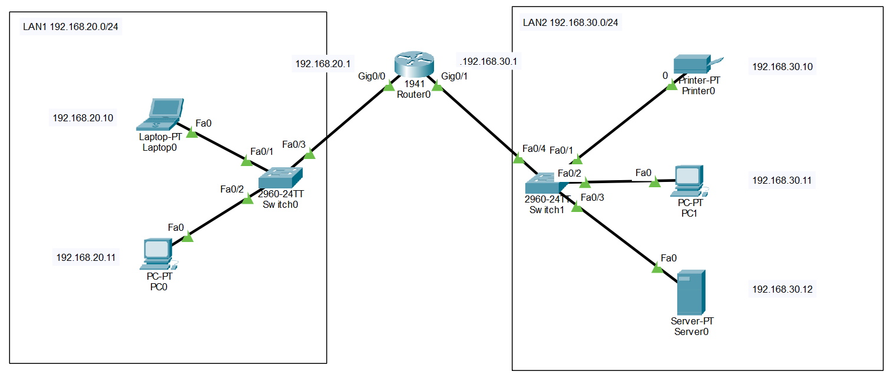

# 🌐 Lab01 — Implementación Básica de una Red de Comunicaciones

> Laboratorio 01 — Seguridad en Redes | UTP Lima


---

## 📝 Descripción

Implementación de una red básica de comunicaciones con dos redes LAN interconectadas mediante un router, configurando direccionamiento IP y verificando conectividad entre dispositivos de distintas redes.

---

## 🗺️ Topología de red



---

## 🎯 Objetivos

- Diseñar una topología con dos redes LAN separadas
- Conectar y configurar switches modelo 2960 y router 1941
- Asignar direccionamiento IP a todos los dispositivos
- Configurar el Default Gateway en cada dispositivo final
- Verificar conectividad entre redes mediante PDU y ping

---

## 🧠 Conceptos aplicados

| Concepto | Detalle |
|---|---|
| 🌐 Topología LAN | Dos redes LAN: 192.168.20.0/24 y 192.168.30.0/24 |
| 🔌 Cableado | Cable UTP directo (Copper Straight Through) |
| 📡 Direccionamiento IP | Asignación estática a PCs, laptops, impresora y servidor |
| 🚪 Default Gateway | Router 1941 como puerta de enlace entre redes |
| ✅ Test de conectividad | Add Simple PDU y comando `ping` desde CLI |

---

## 🖥️ Dispositivos utilizados

| Dispositivo | Modelo | Cantidad |
|---|---|---|
| Router | Cisco 1941 | 1 |
| Switch | Cisco 2960 | 2 |
| Laptop | PC-PT | 2 |
| PC | PC-PT | 2 |
| Impresora | Printer-PT | 1 |
| Servidor | Server-PT | 1 |

---

## 📁 Contenido

```
Lab01_Implementacion_basica.../
│
├── *.pkt          # Archivo de topología Cisco Packet Tracer
├── topologia.png  # Diagrama de red
└── README.md
```

---

## 🚀 ¿Cómo abrir el laboratorio?

1. Instala [Cisco Packet Tracer](https://www.netacad.com/courses/packet-tracer)
2. Abre el archivo `.pkt` incluido en esta carpeta
3. Explora la topología y verifica la conectividad

---

## 🔙 Volver al índice

[← Volver al repositorio principal](../README.md)
