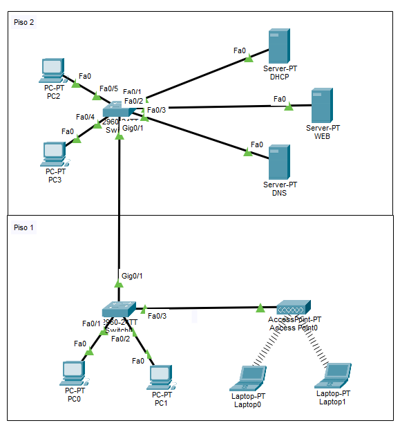

# 📦 Lab02 — Exploración de Paquetes IP y Servicios

> Laboratorio 02 — Seguridad en Redes | UTP Lima


---

## 📝 Descripción

Configuración y análisis de servicios de red esenciales (DHCP, DNS, HTTP) en una red empresarial de dos pisos, usando el **Simulation Mode** de Cisco Packet Tracer para observar el flujo de paquetes en tiempo real.

---

## 🗺️ Topología de red



---

## 🎯 Objetivos

- Diseñar topología de red empresarial con Piso 1 y Piso 2
- Configurar servidores DHCP, DNS y HTTP
- Conectar laptops vía Wi-Fi mediante punto de acceso
- Observar el flujo de paquetes con Simulation Mode
- Verificar conectividad y acceso web por nombre de dominio

---

## 🧠 Conceptos aplicados

| Concepto | Detalle |
|---|---|
| 📡 DHCP | Arrendamiento automático de IPs desde 192.168.20.10 |
| 🌐 DNS | Resolución de dominio `www.utp.edu.pe` → 192.168.20.6 |
| 🖥️ HTTP | Servidor web con página personalizada |
| 📶 Wi-Fi | Laptops con tarjeta WPC300N conectadas al Access Point |
| 🔍 Simulation Mode | Análisis visual del flujo de paquetes DHCP, DNS y HTTP |

---

## 🖥️ Dispositivos utilizados

| Dispositivo | Modelo | Rol |
|---|---|---|
| Switch x2 | Cisco 2960 | Conexión de dispositivos por piso |
| Servidor DHCP | Server-PT | Asignación automática de IPs |
| Servidor DNS | Server-PT | Resolución de nombres de dominio |
| Servidor Web | Server-PT | Hosting de página HTTP |
| Access Point | AP-PT | Conexión inalámbrica de laptops |

---

## 📁 Contenido

```
Lab02_Exploracion_de_paquetes.../
│
├── *.pkt          # Archivo de topología Cisco Packet Tracer
├── topologia.png  # Diagrama de red
└── README.md
```

---

## 🚀 ¿Cómo abrir el laboratorio?

1. Instala [Cisco Packet Tracer](https://www.netacad.com/courses/packet-tracer)
2. Abre el archivo `.pkt` incluido en esta carpeta
3. Activa **Simulation Mode** para observar el flujo de paquetes

---

## 🔙 Volver al índice

[← Volver al repositorio principal](../README.md)
