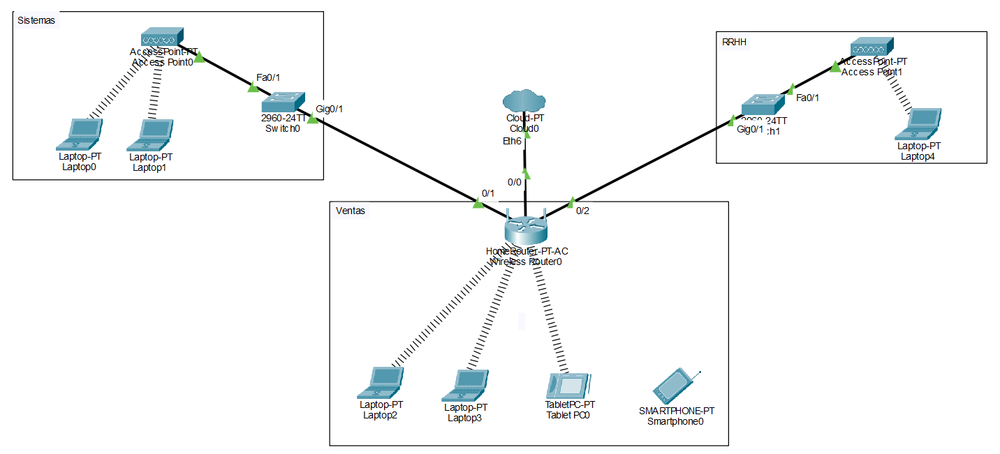

# 🔐 Lab03 — Seguridad de Red Inalámbrica

> Laboratorio 03 — Seguridad en Redes | UTP Lima


---

## 📝 Descripción

Implementación de seguridad en redes inalámbricas para una empresa de 3 áreas (Sistemas, Ventas, Recursos Humanos), configurando autenticación WPA2-PSK, SSIDs diferenciados y filtrado de direcciones MAC para evitar accesos no autorizados.

---

## 🗺️ Topología de red



---

## 🎯 Objetivos

- Configurar puntos de acceso con SSID por área empresarial
- Implementar autenticación WPA2-PSK con encriptación AES
- Conectar laptops, tablets y smartphones a sus redes correspondientes
- Aplicar filtrado de direcciones MAC para bloquear dispositivos no autorizados
- Verificar conectividad entre dispositivos de distintas áreas

---

## 🧠 Conceptos aplicados

| Concepto | Detalle |
|---|---|
| 📶 SSID | Redes diferenciadas: `Sistemas`, `Ventas`, `RRHH` |
| 🔐 WPA2-PSK | Autenticación con clave pre-compartida + AES |
| 🚫 MAC Filter | Bloqueo de dispositivos no autorizados por dirección MAC |
| 🏠 Home Router | Gateway principal con DHCP, DNS y Wi-Fi integrados |
| 📡 Access Points | AP dedicados por área con cobertura de 140m |

---

## 🏢 Topología por áreas

| Área | Dispositivos | SSID | Seguridad |
|---|---|---|---|
| Sistemas | 2 Laptops, AP, Switch 2960 | `Sistemas` | WPA2-PSK / AES |
| Ventas | 2 Laptops, Tablet, Smartphone, Home Router | `Ventas` | WPA2-PSK / AES |
| Recursos Humanos | 1 Laptop, AP, Switch 2960 | `RRHH` | WPA2-PSK / AES |

---

## 📁 Contenido

```
Lab03_Configuracion_de_seguridad.../
│
├── *.pkt          # Archivo de topología Cisco Packet Tracer
├── topologia.png  # Diagrama de red
└── README.md
```

---

## 🚀 ¿Cómo abrir el laboratorio?

1. Instala [Cisco Packet Tracer](https://www.netacad.com/courses/packet-tracer)
2. Abre el archivo `.pkt` incluido en esta carpeta
3. Explora la configuración de seguridad de cada área

---

## 🔙 Volver al índice

[← Volver al repositorio principal](../README.md)
